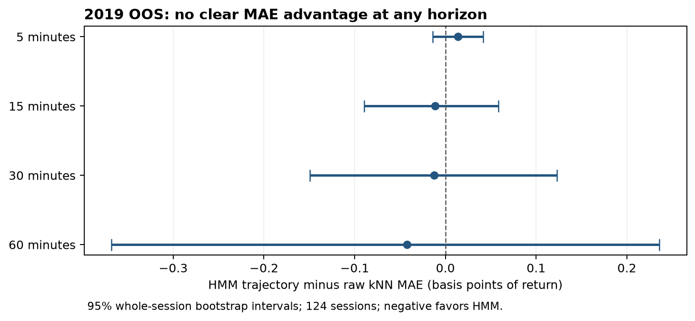

# Intraday HMM analogue retrieval

A reproducible experiment asking whether **Hidden Markov Model posterior
trajectories improve intraday historical-analogue forecasts over normalized
raw-feature kNN**.

**Status: completed with a scoped negative finding.** The frozen SPY five-minute
configuration did not demonstrate incremental forecasting value in July–December
2019. The statistical result is inconclusive, rather than proof of equivalence:
every primary confidence interval includes zero. Further model development and
the proposed seven-year evaluation were stopped after this assessment.

The repository preserves the implementation, tests, methodology, and aggregate
evidence. It is a research reference, not a live trading system.

## Result

The evaluation used **124 out-of-sample sessions**, **5,255 paired query times**,
and **26 accepted weekly HMM fits**, following at least 126 training sessions.
Settings were frozen before inspecting out-of-sample results.

| Horizon | Raw kNN MAE | HMM trajectory MAE | Difference | 95% interval |
|---|---:|---:|---:|---:|
| 5 min | 3.5095 | 3.5232 | +0.0138 | [-0.0140, +0.0416] |
| 15 min | 6.0490 | 6.0376 | -0.0114 | [-0.0895, +0.0585] |
| 30 min | 8.3610 | 8.3487 | -0.0123 | [-0.1491, +0.1227] |
| 60 min | 12.2056 | 12.1632 | -0.0424 | [-0.3681, +0.2360] |

Values are basis points of return. Differences are HMM trajectory minus raw kNN;
negative favors HMM. Intervals use 1,000 paired whole-session bootstrap resamples
with the primary one-session embargo.



Fold signs were mixed. Squared-error and directional Brier comparisons did not
establish an advantage either. The unconditional and same-time-of-day controls
had lower observed MAE than both retrieval methods at every horizon. Those control
rankings are descriptive, not additional predeclared significance tests.

This result applies to the tested configuration and period. It does not establish
that HMMs are universally unhelpful, nor does it imply profitability. See the
[complete findings](experiment-results.md) and [aggregate evidence](docs/results/2019/README.md).

## What is implemented

Six methods share a common walk-forward evaluation cohort:

| Method | Representation or control |
|---|---|
| `unconditional` | All eligible historical outcomes |
| `same_time_of_day` | Eligible outcomes at the same session-minute offset |
| `momentum` | Fixed extrapolation of the recent context return |
| `raw_knn` | Twelve bars of five standardized causal features |
| `hmm_current` | Current six-state filtered posterior |
| `hmm_trajectory` | Twelve bars of six-state filtered posteriors |

The pipeline includes exchange-calendar validation, training-only preprocessing,
causal forward filtering, weekly expanding-history refits, availability purging,
embargo sensitivities, session-bootstrap intervals, state diagnostics, saved
neighbor audits, and a standalone HTML report. An optional long/flat simulation
is disabled by default and was not used for the empirical conclusion.

The five features are log return, rolling realized volatility, high–low range
fraction, time-of-day-adjusted volume surprise, and session VWAP distance.
See [methodology](docs/methodology.md) for the precise contracts and limitations.

## Install and test

Requires Python **3.11+** and [uv](https://docs.astral.sh/uv/getting-started/installation/).
The real-data evaluation used Python **3.13.6** and the versions in `uv.lock`.
From the repository root:

```sh
uv sync --locked --extra dev --python 3.13
uv run --locked pytest -q
uv run --locked ruff check src tests scripts
uv run --locked ruff format --check src tests scripts
```

The tests use constructed fixtures. They need **no API credentials or market-data
download**. The original empirical run was validated with 153 passing tests;
publication checks are also included in the current suite.

## Reproduce the experiment

Market data and full generated runs are excluded from the repository. Obtain your
own input data with the appropriate access rights. A historical Alpaca downloader
is provided; the evaluator itself consumes local Parquet and is vendor-independent.

1. Copy [`.env.example`](.env.example) to `.env` and enter your own Alpaca credentials,
   or supply `APCA_API_KEY_ID` and `APCA_API_SECRET_KEY` as environment variables.
2. Download the 2019 input using explicit SIP, raw adjustment, and preserved per-bar VWAP:

```sh
uv run --locked python -m regime_retrieval.data.alpaca --start 2019-01-01 --end 2019-12-31 --output data/processed/SPY_5m_2019.parquet
```

3. Validate and evaluate the frozen configuration:

```sh
uv run --locked regime-retrieval validate-data --config configs/alpaca_2019.yaml
uv run --locked regime-retrieval run --config configs/alpaca_2019.yaml
```

The run command prints its output directory. Replace `<run_id>` below with that
directory's final component; the report is also generated automatically:

```sh
uv run --locked python scripts/audit_research.py runs/real-2019/<run_id>
uv run --locked regime-retrieval report --run runs/real-2019/<run_id>
```

The measured 2019 run took about **22 minutes** and wrote **2.85 GB**, primarily
neighbor references. Runtime depends on hardware and fit retries. The full
2019–2025 configuration is retained as an unexecuted proposal, not a completed
result; it would require much more storage and compute.

Downloads preserve response pages and checksums, reuse verified cached pages, and
refuse to overwrite datasets. Vendor history can be revised, so a fresh download
may not exactly reproduce the original snapshot. See [reproduction details](docs/reproduction.md)
for the original hashes, pilot, full archive preparation, and output formats.

## Bring your own data

Supply a strictly ordered, timezone-aware Parquet table with:

```text
timestamp, open, high, low, close, volume
```

Optional `vwap` means **per-bar VWAP**, not an already cumulative session VWAP.
Prices must be finite and positive; volume must be finite and nonnegative. Missing
bars are reported and never filled. Duplicate, unsorted, off-grid, or malformed
rows fail validation.

Copy a configuration and set `data.path`. Paths resolve relative to the YAML
file. **Set the correct timestamp convention:** `baseline.yaml` expects bar-end
labels; `alpaca_*.yaml` expects bar-start labels. Internally, every timestamp is
converted to the bar-end availability time.

## Repository layout

```text
configs/                 Frozen baseline and real-data configurations
src/regime_retrieval/     Data, features, HMM, retrieval, evaluation, reporting
tests/                   Behavioral, leakage, and publication regressions
scripts/                 Dataset preparation, artifact auditing, public export
docs/methodology.md       Implemented scientific contracts
docs/reproduction.md     Data acquisition and reproduction details
docs/results/2019/       Aggregate tables, figure, and sanitized run summary
experiment-plan.md       Plan recorded before inspecting OOS results
experiment-results.md    Findings and decision to stop this configuration
```

Credentials, vendor bars, prediction/neighbor files, local notes, environments,
and generated reports stay outside the public source distribution. The published
aggregate files are insufficient to re-audit individual forecasts without obtaining
the underlying data and rerunning the pipeline.

## Contributing and license

This is a completed research experiment. Reproducibility fixes and careful review
are welcome; new representations or tuned variants should be identified as separate
experiments. See [contributing](CONTRIBUTING.md) and
[publication notes](docs/publication.md).

The code and documentation are licensed under [MIT](LICENSE). Market data is not
included, and this license does not grant rights to any vendor's data.
